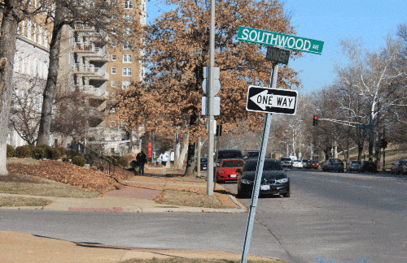
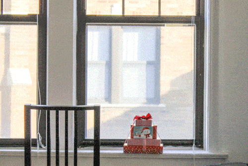

# Demonstration

A sequance of photographs focusing on a specified object 
using various focus lengths from vaious distances can be
a good demonstration of the Dolly Zoom Effect.

Two such sequences are captured and aligned to form GIF
images as below.

The first image, taken outside my apartment,
focuses on a oneway sign on the pavement,
as the buildings in the background seems to move away.

The second image, taken in my apartment, 
focuses on a pile of boxes on the windowsill, 
as the building outside the window seems to move away,
as well as the chair, intentionally placed foreground, 
seems to move closer.

The full-resolution GIF images and the original pictures can be downloaded 
[here](https://drive.google.com/open?id=0BzwupR4ck5R3Y1I1V0lNWkY5TE0&authuser=0);

# The process
All photographs are taken using a Canon EOS REBEL T3 with focal length varying
from 18 to 55.

The first difficulty I met was to find a place suitable for a photographer 
without a track slider.
Such a place should include a foreground object that is easy to focus on,
standing against a background scenery far enough in order to enhance the effect, 
the road in front of which sufficiently long and not too bumpy to keep a constant direction 
of view.

<!---
The first object I chose, after searching around my apartment, was the 
oneway sign on the pavement, as shown above. Because the 
-->

I took 9 pictures for the first scenery and, after finding it amazingly interesting,
23 pictures for the second (only 17 of which are actually used afterwards due to reduced
effect outside some distance).
I aligned them together and cropped the unaligned border, then interpolated 
frames gradually changing on transparency between every two frames, to enhance
the feeling of motion.

# Calculating FOV

As demostrated by the figure above from [Wikipedia](http://en.wikipedia.org/wiki/Angle_of_view),
the angle of view, also known as field of view in photography, of the camera, 
can be (roughly) measured using the following relationship,

$$\mathrm{FOV}=\alpha=2\arctan\frac{L/2}{S_1},$$

where \(L\) is the size of the range of view on distance \(S_1\).
If some object of size \(l\) end up taking \(d\) pixels on
a picture with resolution of \(D\) on that dimension, we would have
\(l/L=d/D\) and thus

$$\mathrm{FOV}=2\arctan\frac{lD}{2dS_1}.$$

Take the second sequance for calculation.
According to the measurement, the bottom one of the boxes is about 23.3cm wide. 
The nearest picture (IMG_3004.JPG) was taken about 137cm away from the boxes,
on which the box takes about 650 pixels wide, while the pictures is of 4272 pixels wide. 
Plugin them into the relationship above and we get \(FOV=58.4^\circ\).

The farthest picture (IMG_3032.JPG) was taken about 881cm away from the boxes,
on which the box takes about 269 pixels wide.
Plugin them into the relationship above and we get \(FOV=23.7^\circ\).

