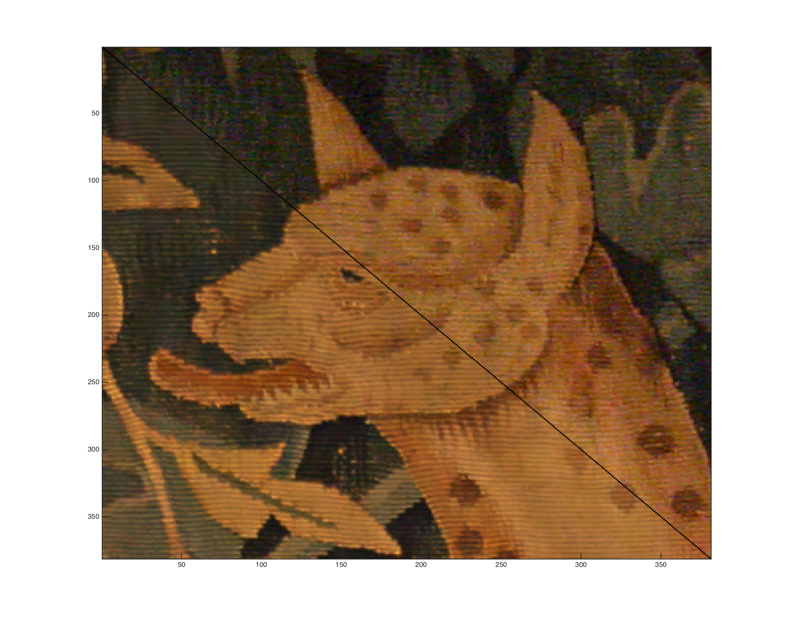

_Hint: Click images to enlarge._

# Abstract

NFN algorhim is implemented to restore the view in a dim circumstance
without the assistance of a tripod
by combining the picture taken with flash and one with no flash.

# Demonstration 
_Carpet_, the detail. Notice that the noises of NF has vanished, particularly
on the neck to the bottom right.

_Carpet_, a broad view. Notice that the dim color is well preserved.

_PotsDetail_, the detail. Denoising is particularly noticable 
on the wall to the top right.

# Discussion
- The algorithm is pretty unstable for it requires a lot of parameters
that cannot be derived, but manually specified instead, especially that 
for deriving the flash shadow.
