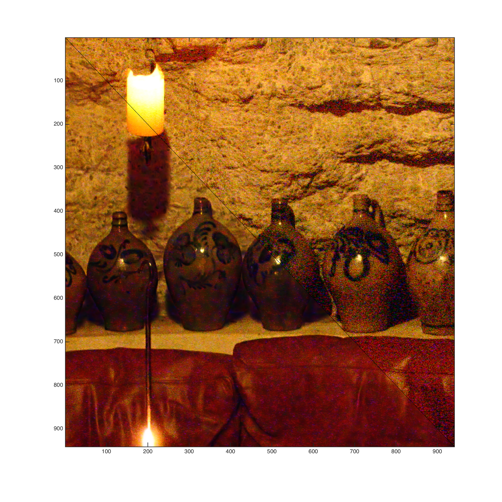

_Hint: Click images to enlarge._

# Abstract

NFN algorhim is implemented to restore the view in a dim circumstance
without the assistance of a tripod
by combining the picture taken with flash and one with no flash.

# Demonstration 
_Cave01_, the detail. Notice that the noises both on the wall
and on the vase both vanished greatly.

_Carpet_, the detail. Notice that the noises of NF has vanished, particularly
on the neck to the bottom right.

_Carpet_, a broad view. Notice that the dim color is well preserved.

_PotsDetail_, the detail. Denoising is particularly noticable 
on the wall to the top right.

# Discussion
- The algorithm is pretty unstable for it requires a lot of parameters
that cannot be derived, but manually specified instead, especially that 
for deriving the flash shadow.
- The first problem I met was that the bilateral filter almost never worked.
The problem turns out to be that the data are in uint8 and the 
all the filter does is to change some pixels up or down 1 or 2.
I then converted them to double and normalized them to 1, but 
I have to change them back to uint8 regularly to suits the protocol 
of the image functions of MATLAB.
- The second problem I met was that the algorithm to detect flash
shadows are not clearly described - at least not convincable 
in my view - especially the algorithm to generate A_lin and F_lin. 
What I decided to do at last is to synchronise them 
by normalizing them by their average value (or sum of values 
since they are of the same size). An ``adequate'' (again) 
Gaussian filter is then applied to the mask before applied to the picture.
- The script can be viewed [here](proj1/fnf.m).

