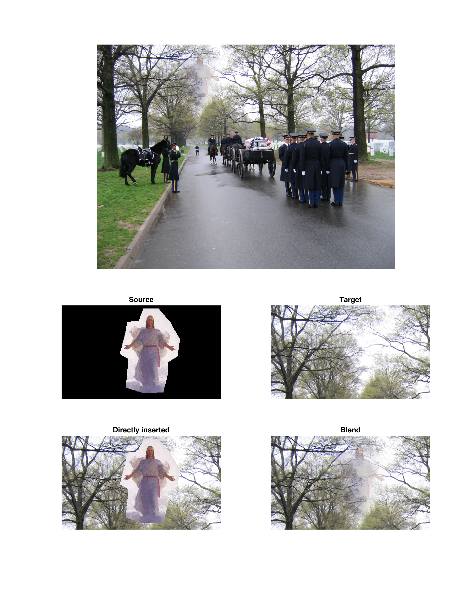

_Hint: Click on images to enlarge._

# Abstract

This project demonstrates gradient-domain fusion, an algorithm that merges an image into
a background with a natural transition and effect by 
adapting the tone of the source image to that of the edge part from the background,
while preserving the characteristics.

# Demonstration 

## Image reconstruction
Image reconstruction from the gradient was used as a small test of 
the method of quadratic minimization. It should be able to perfectly reconstruct 
the image based on its _x_-gradient, _y_-gradient, and the absolute value of 
one of its pixels (here the first pixel was used). 

The result shows that the error from image reconstructed to the original one 
is 9.4309e-14, proving the validity of this method.

## Poisson blend, and penguin
Poisson blend is essentially a quadratic problem which derives the value of those pixels 
that takes the _absolute value_ of the background on the edges, and the 
_gradient_ of souce image on the internal.

Shown below is the result of merging a penguin onto a snowfield.
Notice that the tone of the penguin has been changed to adopt 
the tone around it in the new place, while it is still 
recognizable because the gradient, which is the most important information 
for human to recognize an object, is reserved.

However, the edge does not look perfectly natural either. 
The texture of the snow field disappears abruptly near the penguin.
Additionally, the penguin casts its shadow to the bottom of the image,
while the people to the right, which is an inherent inconsistancy unsolvable 
soly by the algorithm.

## Scaling, and monster
Before moving further, I realized it was necessary to scale the source image 
before merging it into the target background.
I then modified the function _alignSource_ to receive two clicks,
the first the same as previously to indicate the bottom-center position, 
and the second one to indicate the highest latitude that it should reach.
It can be further modified to include rotation and/or other functionalities,
but I decided they were not essential and would only complicate the program 
unnecessarily.

The second example, as shown below, tries to merge the picture of a monster into 
a swimming pool behind an unaware man. (_I do not know this man_. I found it on Google.)
Let's forget the fact that the monster ends up looking like a tadpole, but the 
result still looks far from being ideal for the following reasons:

1. The monster is expected to cast a shadow on the floor of the pool. 
1. The wave on the monster is significantly smaller than outside. 
1. The wave of the pool seems to suddenly turn into a mess when going near 
    the monster. 
    That is also because the wave near the monster is smaller than in the pool.

The first reason seems kind of "structural", while the other two 
are both due to the scaling of the source image. In fact,
the original "monster" are meant to be something of tens of meter long,
therefore waves natural at that scale turn to "spray" then scaled to 
only about 2 meters long.

Despite all these shortages, it still successfully changed the tone
of the orignal monster to the blue-ish one of the pool, much 
better than any kind of crop-and-insertion.

## Opacity, and Jesus
For the third example, I realized I could try on merging with opacity settings.
The idea is that the "source gradient" part that we used in solving
the minimization problem, could be replaced by a mixture of 
the source gradient and the target gradient, each taking portion alpha and 1-alpha
respectively.
It degenerates to the original merging problem when alpha = 1.
The result of this method should be similar, but still not identical, 
to directly mix the result without transparency with the original target 
_afterwards_.

Before demostrating the third example, I must note that _I mean 
no offense to any religion_. This example, shown below, merges a 
semitransparent figure of Jesus onto the sky above a funeral march. 
The alpha is deliberately lowered to 0.3 to create a looming effect.

The result seems quite ideal.

## Mixed blending, and relief
The idea of mixed blending is that, instead of deriving pixels whose 
gradient is closer to that at the same position in source image,
we make it closer to that in the source _or_ target image, whichever 
has a greater absolute value. This method can be used 
to preserve both the texture of the source and the target.

For the demonstration, instead of reusing the example in the paper 
(scripts on a stone wall), I tried to merge 
a sandy plane with a relief sculpture.
The result is shown as the title picture, while the intermediate steps
are shown below.

The sand in the background image is deliberately chosen to be too coarse 
for the detail of the foreground relief, only to form a magical effect.

However, the effect is yet far from ideal. It looks more like 
normal sand _printed_ with relief-like pattern. 
This is possibly because the texture of the sand is too noisy, which
means the gradient of the sand frequently overwhelms that of the relief,
so frequent that the texture of the relief is seldom picked.
In fact, I has already modified the algorithm to pick the background side
only when its gradient is twice as large as that of the relief.
Another possible reason could be the overwhelming shadow of the origin relief.
It looks a lot thicker than what we expect a sand relief could cast. 

Another issue demonstrated here is the effect of inappropriate selection of
the region of the source image, 
which can be easily inferred to be the cause of
the white "shadow" at the top right corner.
The original image of the relief is in fact surrounded by 
a dark "frame". 
When part of the dark frame is included in the region and as the border
pixels of the region (hard to avoid because it is too close to the useful part), 
the algorithm will try to match that part 
with the corresponding value of the background. As it then matches the gradient 
between the frame and the pixel just inside of it afterwards, the pixel
inside is forced to be almost white since the frame is so dark.
This issue can be avoided by carefully select the souce region.
In fact, the title image is a perfected version, 
but I still want to include a imperfect one here to point out this issue.

# Discussion
- The selection of images are actually heavily limited. It is very important 
  that the border of valid source image consists of similar colors, otherwise
  the algorithm will either spend all its effort to falsely match 
  the border (when the source gradient is low in the neighborhood), as 
  the "white shadow", or it will just forget the border matching and leaves
  an abrupt change (earlier failed trials of mine).
- The algorithm only tests the gradient one pixel away, which makes
  it unstable on images with rapid changes locally, such as the sand.
- Inherent inconsistancies exist, like the heavily shrinked wave on the monster,
  or the incorrectly cast shadow of the penguin.

# Other resources
- [poissonBlend.m](proj2/poissonBlend.m)
- [mixedBlend.m](proj2/mixedBlend.m). Simply calls poissonBlend.
- Modified [alignSource.m](proj2/alignSource.m), receives two clicks to scale 
    the source image.
